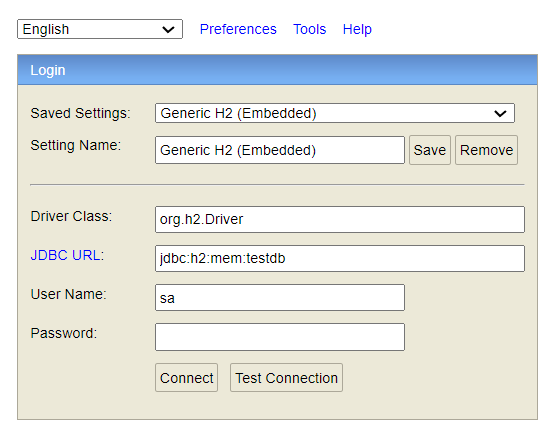
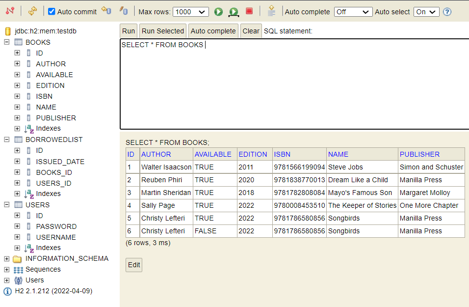

<div id="header" align="center">
  
</div>
<div id="badges" align="center">
  <a href="https://www.linkedin.com/in/ajith-solomon-sekar">
    
  </a>
</div>

# Library-Management

[Spring Boot](http://projects.spring.io/spring-boot/) application that exposed REST API for below functionalities developed in TDD process

* User can view books in library
* User can borrow a book from the library
* User can return books to the library

## Requirements

For building and running the application you need:

* 	[JDK](https://www.oracle.com/java/technologies/javase/jdk17-archive-downloads.html) - Java SE Development Kit 17
* 	[Maven](https://maven.apache.org/download.cgi) - Project Management Tool

### Running the application with IDE

There are several ways to run a Spring Boot application on your local machine. One way is to execute the `main` method in the `com.ajithsolomon.librarymanagement.LibraryManagementApplication` class from your IDE.

* 	Download the zip
* 	Unzip the zip file
* 	Open Command Prompt and Change directory (cd) to folder containing pom.xml
* 	Open Eclipse
	* File -> Import -> Existing Maven Project -> Navigate to the folder where you unzipped the zip
	* Select the project
* 	Choose the Spring Boot Application file (search for @SpringBootApplication)
* 	Right Click on the file and Run as Java Application

* 	URL to access application: **http://localhost:8080/library-management/**

### Running the application with Maven

Alternatively you can use the [Spring Boot Maven plugin](https://docs.spring.io/spring-boot/docs/current/reference/html/build-tool-plugins-maven-plugin.html) like so:

```shell
$ cd library-management
$ mvn spring-boot:run

```shell
mvn spring-boot:run
```
### Accessing Data in H2 Database

#### H2 Console

URL to access H2 console: **http://localhost:8080/library-management/h2-console**

Fill the login form as follows and click on Connect:

* 	Saved Settings: **Generic H2 (Embedded)**
* 	Setting Name: **Generic H2 (Embedded)**
* 	Driver class: **org.h2.Driver**
* 	JDBC URL: **jdbc:h2:mem:testdb**
* 	User Name: **sa**
* 	Password:





### Testing API

#### To view all books available in the library
GET **http://localhost:8080/library-management/v1/books**

#### To borrow book from the library
PATCH **http://localhost:8080/library-management/v1/borrow-book**

Request Body:
**{
    "userId": 2,
    "bookId": 6
}**

#### To return books to the library
PATCH **http://localhost:8080/library-management/v1/return-book**

Request Body:
**{
    "userId": 2,
    "bookIdArray": [4, 6]
}**

## Swagger Documentation

Swagger API documentation can be found at **http://localhost:8080/library-management/swagger-ui/index.html**

